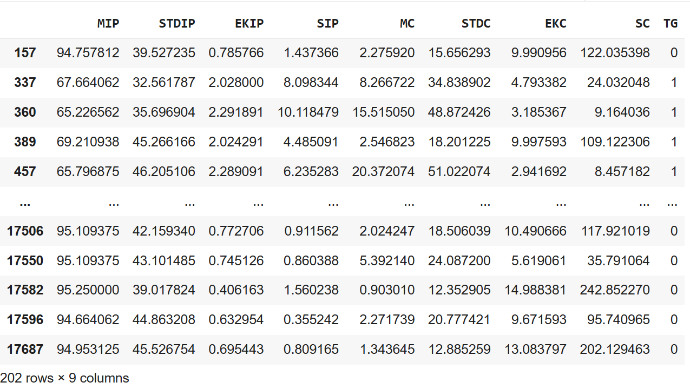
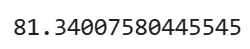
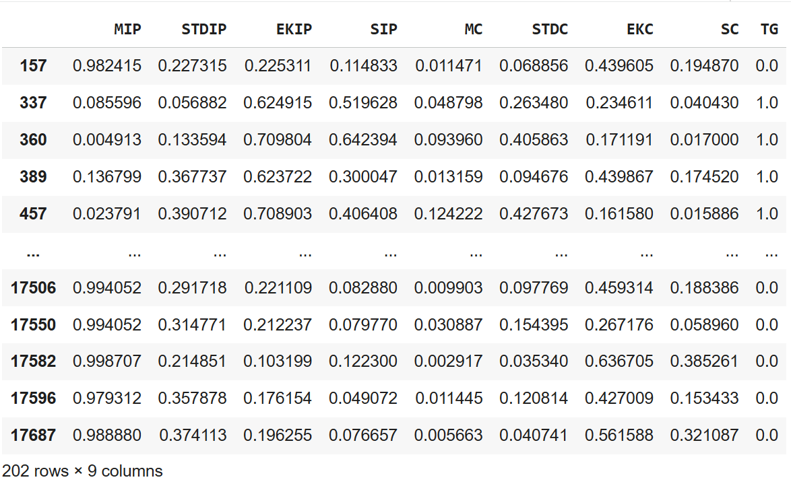
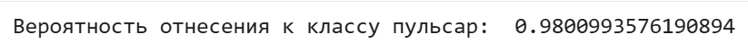
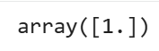
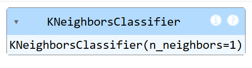

# pulsar-classification
## Проект по классификации пульсаров с помощью машинного обучения.
В наборе данных pulsar_stars_new.csv содержатся сведения о звездах, полученные в ходе исследовании вселенной High Time Resolution Universe Survey с целью определения одного из типа нейтронных звезд — пульсаров. 
Поле **TARGET** таблицы **pulsar_stars_new** является откликом, все остальные поля — предикторы.


## 🌟 О проекте
Пульсары - одни из самых загадочных объектов во Вселенной. Их идентификация в огромных потоках астрономических данных представляет собой сложную задачу. Данный проект демонстрирует применение машинного обучения для автоматизации этого процесса.

## Признаки для классификации
Проект использует следующие характеристики звезд:

+ **Средняя интенсивность импульса (MIP)**

+ **Стандартное отклонение импульса (STDIP)**

+ **Эксцесс профиля импульса (EKIP)**

+ **Асимметрия профиля импульса (SIP)**

+ И другие статистические параметры

## 🎯 Основные возможности
+ Загрузка и предобработка астрономических данных

+ Анализ характеристик звезд с помощью статистических методов

+ Классификация объектов с использованием двух алгоритмов ML

+ Оценка вероятности отнесения к классу пульсаров

+ Визуализация результатов в удобном формате

## 🛠️ Техническая реализация
### Алгоритмы машинного обучения
**1. Логистическая регрессия**
+ **Принцип**: Построение линейной разделяющей границы между классами

+ **Преимущества**: Высокая интерпретируемость, быстрая работа

+ **Применение**: Оценка вероятности принадлежности к классу пульсаров

**2. Метод k-ближайших соседей (k-NN)**
+ **Принцип**: Классификация на основе ближайших объектов в пространстве признаков

+ **Преимущества**: Простота реализации, не требует предположений о распределении данных

+ **Применение**: Точная классификация на основе схожести с известными пульсарами
## 📚 Этапы проекта

**Загрузим данные из файла**
```python
import pandas as pd
import warnings
warnings.filterwarnings("ignore")    # Используем для 'чистого' вывода
stars = pd.read_csv("pulsar_stars_new.csv")
```
**Убедимся, что данные загружены корректно**
```python
stars.head()    # Выводим первые 5 строк таблицы
```
.png)
**Выберем интересующие нас данные (Создадим выборку):**

+ Все строки таблицы, где TARGET = 0 и MIP ∈ [94.6640625, 95.2890625]
+ Все строки таблицы, где TARGET = 1 и MIP ∈ [65.078125, 70.7421875]

```python
stars_train = stars[((stars['TG'] == 0) & (stars['MIP'] >= 94.6640625) & (stars['MIP'] <= 95.2890625)) | ((stars['TG'] == 1) & (stars['MIP'] >= 65.078125) & (stars['MIP'] <= 70.7421875))]
stars_train
```


**В полученном наборе 202 строки**
```python
# Среднее столбца MIP
print(stars_train.MIP.mean())
```



**Выполним линейную нормировку**
```python
stars_train_normed = (stars_train - stars_train.min())/(stars_train.max() - stars_train.min())
stars_train_normed
```


```python
# Среднее столбца MIP после нормировки
print(stars_train_normed.MIP.mean())
```
.png)

**Построим классификатор на основе логистической регрессии**
```python
# Предикторы
X = pd.DataFrame(stars_train_normed.drop(['TG'], axis=1))
# Отклики
y = stars_train_normed.TG
```
```python
from sklearn.linear_model import LogisticRegression
clf = LogisticRegression(random_state=2019, solver='lbfgs').fit(X, y)
```

**Выполним классификацию новой звезды (с помощью логистической регрессии) с параметрами:**

[0.254, 0.19, 0.939, 0.624, 0.935, 0.875, 0.151, 0.312]

```python
new_star = [0.254, 0.19, 0.939, 0.624, 0.935, 0.875, 0.151, 0.312]
clf.predict_proba([new_star])
print('Вероятность отнесения к классу пульсар: ', clf.predict_proba([new_star])[0][1])
```


```python
clf.predict([new_star])
```


**KNN**
```python
from sklearn.neighbors import KNeighborsClassifier
# Создадим объект класса KNeighborClassifier
neigh = KNeighborsClassifier(n_neighbors = 1, p = 2)
# Обучаем классификатор на тренировочных данных
neigh.fit(X, y)
```



```python
print('Предсказанный класс: ', neigh.predict([new_star])[0])
print('Расстояние до ближайшей звезды: ', neigh.kneighbors([new_star])[0][0][0])
```


## 🎯 Результаты
Проект позволяет:

+ Автоматически классифицировать звезды как пульсары/не пульсары

+ Оценивать вероятность принадлежности к классу пульсаров

+ Определять расстояние до ближайших известных объектов в пространстве признаков
